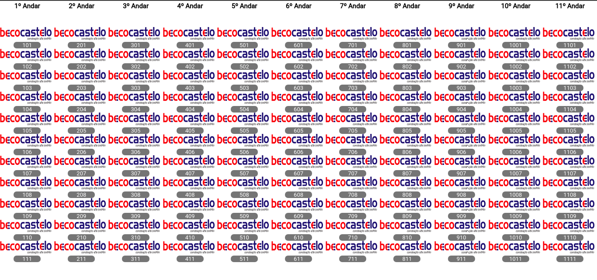

# PAINEL DE SALAS





A PROPOSTA DESSA APLICAÇÃO É TORNAR SIMPLES A IDENTIFICAÇÃO DAS EMPRESAS PRESENTES EM EMPREENDIMENTOS QUE SÃO COMERCIAIS.S 

### REQUISITOS 

[NODEJS > 12.14.1](https://nodejs.org/en/)

[NPM](https://www.npmjs.com/get-npm) ou [YARN](https://classic.yarnpkg.com/en/docs/install/#debian-stable)

[MYSQL](https://www.apachefriends.org/pt_br/download.html)

[CURL](https://curl.haxx.se/download.html)

## PARA COMEÇAR 

INICIE O BANCO DE DADOS 

```yml
    sudo /opt/lampp/./xampp startmysql 
```

ACESSE A PASTA `backend` DO PROJETO

```yml
    yarn install && yarn start 
```

ACESSE A PASTA `fronend` DO PROJETO

```yml
   yarn server
```


### CRIAÇÃO DO USUÁRIO ADMINISTRADOR E PROVISONAMENTO DO BANCO

Acesse a interface do seu banco mysql http://`seuendereçoip`/phpmyadmin/

Copie o conteúdo do arquivo `PAINEL/provisioning.sql`, cole e execute 

# AUTENTICAÇÃO INICIAL

`Username`: admin
`Password`: admin


