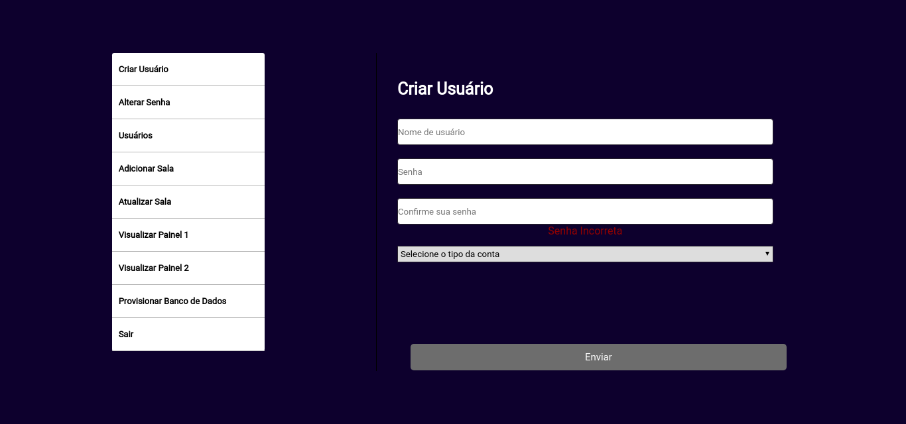
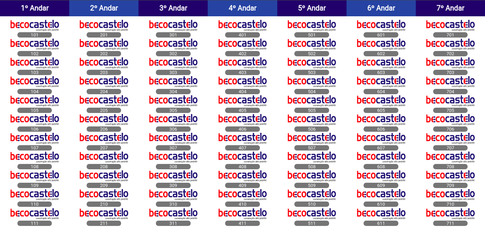
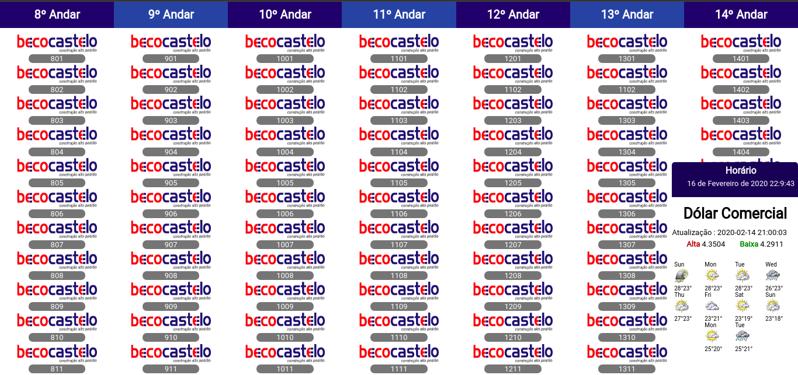
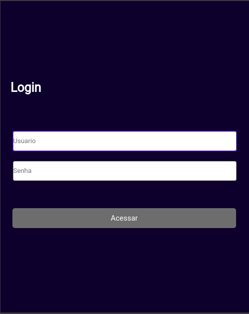
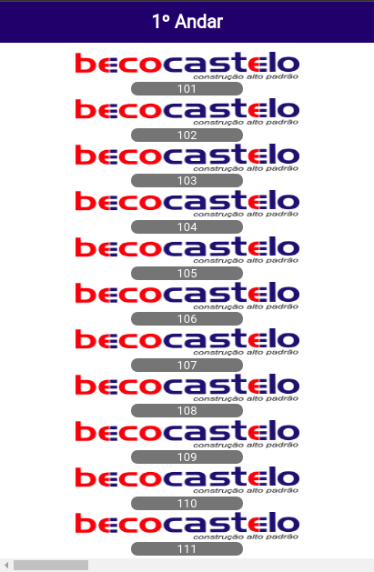
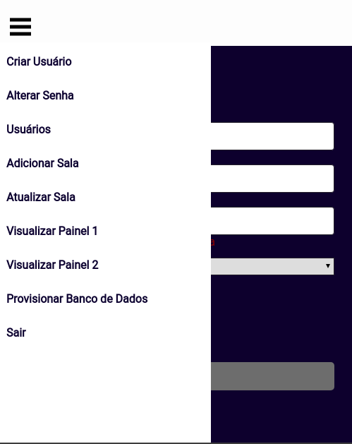

<h1 align="center"> PAINEL DE SALAS</h1>

<p align="center">
  
</p>

A PROPOSTA DESSA APLICAÇÃO É TORNAR SIMPLES A IDENTIFICAÇÃO DAS EMPRESAS PRESENTES EM EMPREENDIMENTOS QUE SÃO COMERCIAIS 

### REQUISITOS 

[NODEJS > 12.14.1](https://nodejs.org/en/)

[NPM](https://www.npmjs.com/get-npm) ou [YARN](https://classic.yarnpkg.com/en/docs/install/#debian-stable)

[Docker](https://docs.docker.com/install/)

[Docker Compose](https://docs.docker.com/compose/)


## PARA COMEÇAR 

Acesse a pasta do projeto 

Rode o comando baixo:

```shell
docker-compose up

```
e acesse http://0.0.0.0:8080


### AUTENTICAÇÃO INICIAL

`Username`: admin

`Password`: admin


### SKETCHES

#### WEB 

<table>
    <tr>
        <td></td>
    </tr>
    <tr>
        <td></td>
    </tr>
     <tr>
        <td></td>
    </tr>
     <tr>
        <td></td>
    </tr>
</table>

### MOBILE 

<table>
    <tr>
        <td></td>
    </tr>
    <tr>
        <td></td>
    </tr>
    <tr>
         <td></td>
    </tr>
     <tr>
        <td></td>
    </tr>
    <tr>
        <td></td>
    </tr>
</table>


`apk:` [address](https://exp-shell-app-assets.s3.us-west-1.amazonaws.com/android/%40jadson179/Painel-5aad65f531a9401dbcda37fd677efc24-signed.apk)

# CONTRIBUIDORES 

<table>
    <tr>
        <td><a href="https://github.com/jadson179"></a></td>
    </tr>
</table>


